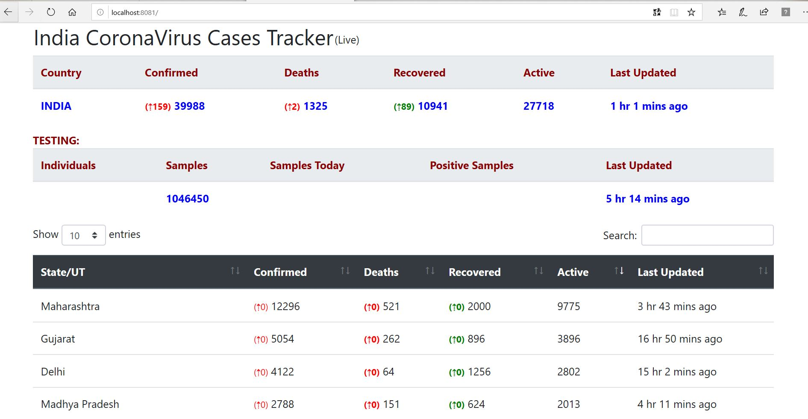

# CoronaVirusTracker (POC)

 

### Docker Hub repo(docker image)
https://hub.docker.com/repository/docker/paragmahajan27/coronavirustracker/tags?page=1

### Technologies Used:
**UI**: html, js,jquery,bootstrap, thymeleaf
**services/controller/backend**: java 14, spring boot 2, spring rest, docker, micrososerives
**build, packaging, deployment**:maven 

**Addtional technologies to be added**: kubernetes, spring caching.
